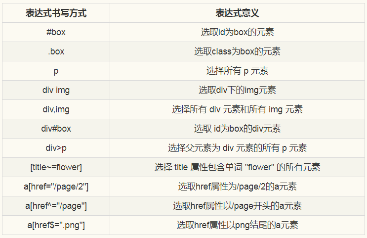
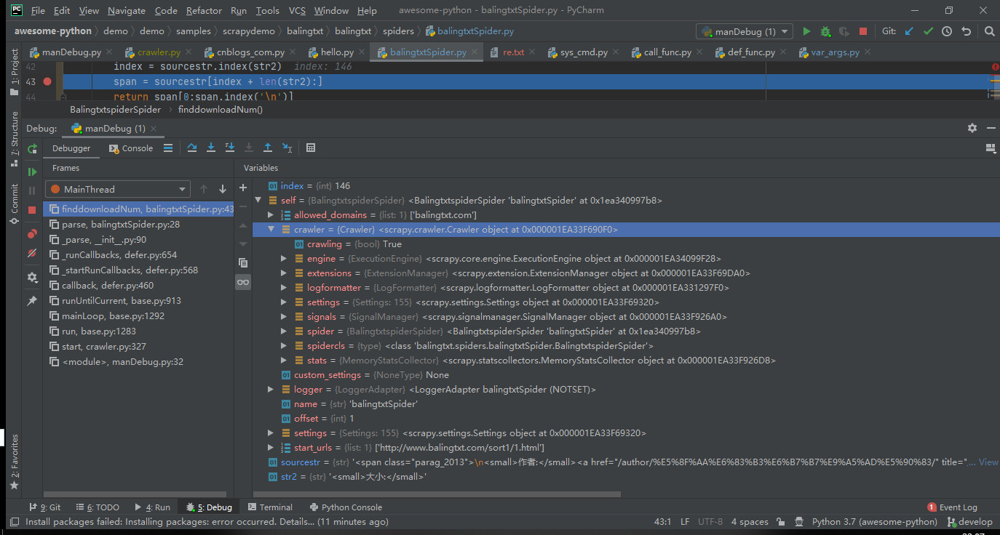

# 引用库
* [lxml 4.4.1.0]()
* [cssselect]()
* [parsel]()
* [w3lib](https://github.com/scrapy/w3lib) remove comments, or tags from HTML snippets
* [Twisted]()
* [urllib]()urllib是python内置的http请求库，本文介绍urllib三个模块：请求模块urllib.request、异常处理模块urllib.error、url解析模块urllib.parse

# 目标
1. Python 的解析库 xpath、pyquery、beautifulSoup、 json、 xml.sax、 re

3. https://mp.weixin.qq.com/s?__biz=MzU2ODYzNTkwMg==&mid=2247484770&idx=1&sn=16427865c7b2785594acfbcf4505e26f&chksm=fc8bbdf3cbfc34e5856dd36dd825f9b89b05a4ab3def08dac48b760771e4ee0454fdf9ddee72&scene=27#wechat_redirect
# 2.scrapy 选择器
（1） 正则表达式 ——re()

（2）xpath——xpath()

（3）CSS——css()

response.css("xxx").extract() ——提取所有节点（然后可以通过循环遍历所有的子节点）
response.css("xxx").extract_first() ——提取第一个节点
response.css("xxx::text").extract_first()——获取节点的内部文本
response.css("xxx::attr()").extract_first()——获取节点的属性值（不用加引号）
（4）序列化该节点为unicode字符串并返回list——extract()

## crawl
scrapy crawl  balingtxtSpider -o itm.json -s FEED_EXPORT_ENCODING=utf-8
scrapy crawl example -o example.db -t sqlite3 

## css
类选择器：元素的class属性，比如class="box"表示选取class为box的元素；
ID选择器：元素的id属性，比如id="box"表示选取id为box的元素；
元素选择器：直接选择文档元素，比如p表示选择所有的p元素，div表示选择所有的div元素；
属性选择器：选择具有某个属性的元素，如*[title]表示选择所有包含title属性的元素、a[href]表示选择所有带有href属性的a元素等；
后代选择器：选择包含元素后代的元素，如li a表示选取所有li 下所有a元素；
子元素选择器：选择作为某元素子元素的元素，如h1 > strong表示选择父元素为h1 的所有 strong 元素；
相邻兄弟选择器：选择紧接在另一元素后的元素，且二者有相同父元素，如h1 + p表示选择紧接在 h1 元素之后的所有p元素；
scrapy 中的css使用方法
以a元素来举例说明

response.css('a')：返回的是selector对象；
response.css('a').extract()：返回的是a标签对象；
response.css('a::text').extract_first()：返回的是第一个a标签中文本的值；
response.css('a::attr(href)').extract_first()：返回的是第一个a标签中href属性的值；
response.css('a[href*=image]::attr(href)').extract()：返回所有a标签中href属性包含image的值；
response.css('a[href*=image] img::attr(src)').extract()：返回所有a标签下image标签的src属性；

##  xpath
xpath('//a')    # 所有a标签(子孙后代)
xpath('//a[2]')        # 所有a标签，按索引找第二个

xpath('//a[@id]')    # 所有a标签，并且含有id属性
xpath('//a[@id="i1"]')        # 所有a标签，并且属性id='i1'
xpath('//a[@href="link.html"][@id="i1"]')    # 所有a标签，属性href="link.html" 而且 id="i1"

xpath('//a[contains(@href, "link")]')    # 所有a标签，属性href的值包含"link"
xpath('//a[starts-with(@href, "link")]')    # 所有a标签，属性href的值以"link"开头
xpath('//a[re:test(@id, "i\d+")]')        # 所有a标签 属性id的值 符合正则表达式"i\d+"的规则

xpath('//a[re:test(@id, "i\d+")]/text()').extract()        # 所有a标签，取text的值
xpath('//a[re:test(@id, "i\d+")]/@href').extract()        # 所有a标签，取href的属性值

xpath('/html/body/ul/li/a/@href').extract()        # 取所有的值
xpath('//body/ul/li/a/@href').extract_first()    # 取第一个值
response.xpath(//*[@itemprop="name"][1]/text()').extract())
response.xpath('//*[@itemprop="price"][1]/text()').re('[.0-9]+'))
response.xpath('//*[@itemprop="description"][1]/text()').extract())
response.xpath('//*[@itemtype="http://schema.org/''Place"][1]/text()').extract())
response.xpath('//*[@itemprop="image"][1]/@src').extract())

- 
1）contains(str1,str2)  用来判断str1是否包含str2
例1：//*[contains(@class,'c-summaryc-row ')]  选择@class值中包含c-summary c-row的节点
例2：//div[contains(.//text(),'价格')]  选择text()中包含价格的div节点

2）position()  选择当前的第几个节点
例1：//*[@class='result'][position()=1]   选择@class='result'的第一个节点
例2：//*[@class='result'][position()<=2]   选择@class='result'的前两个节点

3）last()  选择当前的倒数第几个节点
例1：//*[@class='result'][last()]   选择@class='result'的最后一个节点
例2：//*[@class='result'][last()-1]   选择@class='result'的倒数第二个节点

4）following-sibling 选取当前节点之后的所有同级节点
例1：//div[@class='result']/following-sibling::div   选择@class='result'的div节点后所有同级div节点     找到多个节点时可通过position确定第几个如：//div[@class='result']/following-sibling::div[position()=1]

5）preceding-sibling 选取当前节点之前的所有同级节点
使用方法同following-sibling

二、过滤信息
1）substring-before(str1,str2)  用于返回字符串str1中位于第一个str2之前的部分
例子：substring-before(.//*[@class='c-more_link']/text(),'条')
返回.//*[@class='c-more_link']/text()中第一个'条'前面的部分，如果不存在'条'，则返回空值

2）substring-after(str1,str2)  跟substring-before类似，返回字符串str1中位于第一个str2之后的部分
例1：substring-after(.//*[@class='c-more_link']/text(),'条')
返回.//*[@class='c-more_link']/text()中第一个’条’后面的部分，如果不存在'条'，则返回空值
例2：substring-after(substring-before(.//*[@class='c-more_link']/text(),'新闻'),'条')
返回.//*[@class='c-more_link']/text()中第一个'新闻'前面与第一个'条'后面之间的部分

3）normalize-space()
用来将一个字符串的头部和尾部的空白字符删除，如果字符串中间含有多个连续的空白字符，将用一个空格来代替
例子：normalize-space(.//*[contains(@class,'c-summaryc-row ')])

4）translate(string,str1,str2)
假如string中的字符在str1中有出现，那么替换为str1对应str2的同一位置的字符，假如str2这个位置取不到字符则删除string的该字符
例子：translate('12:30','03','54')   结果：'12:45'

三、拼接信息
1）concat()  函数用于串连多个字符串
例子：concat('http://baidu.com',.//*[@class='c-more_link']/@href)

## link
* [Python_Master_Courses](https://github.com/makelove/Python_Master_Courses/) Python大师课程 
* [itcast.cn教程](https://github.com/AndyofJuly?tab=repositories)
* [smart_login](https://github.com/SpiderClub/smart_login) 各大网站登陆方式，有的是通过selenium登录，有的是通过抓包直接模拟登录
* [SpiderClub](https://github.com/SpiderClub) 分布式爬虫
* [spiders](https://github.com/asen477/scrapy/blob/master/goods/goods/spiders/jd_spider.py) mysql jd
* [wechat-spider)](https://github.com/pythonchannel/wechat-spider) 微信手机客户端爬虫，爬取公众号所有 文章、阅读量、点赞量和评论内容 ---思路比较细
* [wechat-spider)](https://github.com/striver-ing/wechat-spider) 开源微信爬虫：爬取公众号所有 文章、阅读量、点赞量和评论内容。易部署。持续维护！！！
*  weixin_crawler是一款使用Scrapy、Flask、Echarts、Elasticsearch等实现的微信公众号文章爬虫，自带分析报告和全文检索功能，几百万的文档都能瞬间搜索。
*  好文章链接
* 
* [awesome-web-scraping](https://github.com/lorien/awesome-web-scraping/blob/master/python.md#web-scraping) 156个Python网络爬虫资源
*
*
*
*
